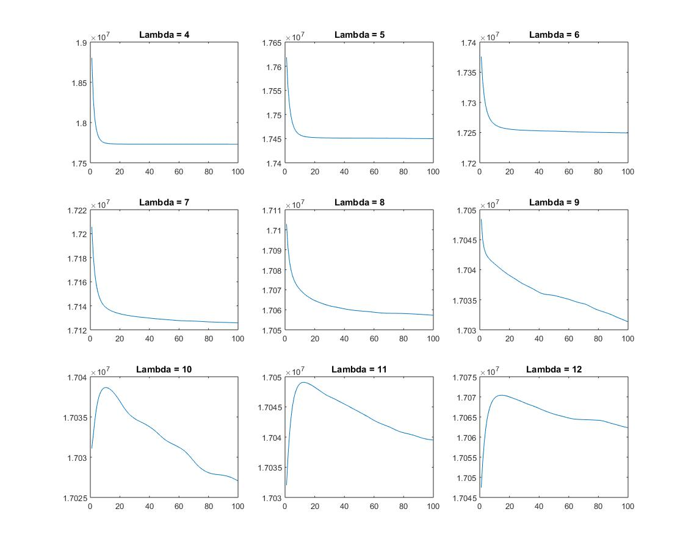

# UCLA Math 197: Image Processing
This repository contains codes for the course *Individual Studies: Literature on Image Processing (UCLA Math 197)*. Most of the codes are written in Matlab.

#### Rudin-Osher-Fatemi model

######L2 energy
100 times iterations

#####L1 energy
100 times iterations

